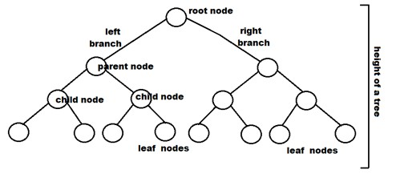

# Doing hardthings (ALX) binary_trees

A binary tree is a tree data structure in which each node has at most two children, referred to as the left child and the right child. The topmost node of the tree is called the root.

A binary tree is a recursive data structure, which means that each subtree is also a binary tree. The left subtree of a node contains only nodes with keys less than the node's key, and the right subtree contains only nodes with keys greater than the node's key.

Binary trees are widely used in computer science and are the foundation for many other data structures and algorithms, such as binary search trees, heaps, and Huffman coding trees.

# Some key terms associated with binary trees include:

# Root: 

The topmost node of a tree, from which all other nodes descend.
# Leaf: 
A node with no children.
# Internal node:
 A node with at least one child.
# Parent:
 A node with at least one child.
# Child:
 A node connected to a parent.
# Sibling: 
Nodes that share the same parent.
Binary trees can be traversed in a few different ways, including:

# In-order traversal: 
Traverse the left subtree, visit the root, and traverse the right subtree.
# Pre-order traversal: 
Visit the root, traverse the left subtree, and traverse the right subtree.
# Post-order traversal:
 Traverse the left subtree, traverse the right subtree, and visit the root.

# Some common operations performed on binary trees include:

# Insertion:
 Adding a new node to the tree
# Deletion:
 Removing a node from the tree
# Traversal: 
Visiting all the nodes in the tree in a specific order (such as in-order, pre-order, or post-order)
# Searching:
Finding a specific node in the tree based on its key value

Binary trees can be implemented using various data structures, such as arrays or linked lists. They are commonly used to represent hierarchical structures in computer science, such as file systems, decision trees, and expression trees.
